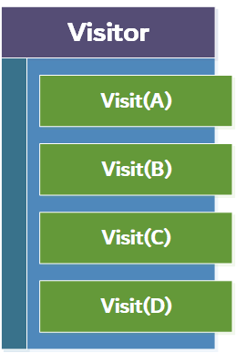
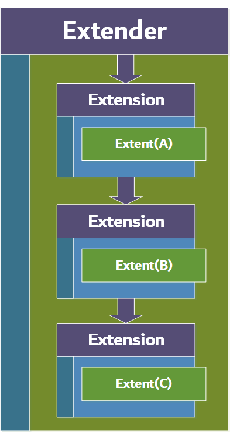
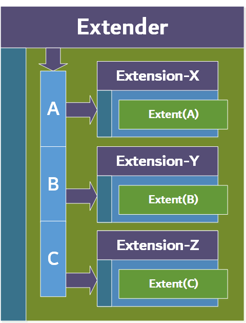

#  Xtender


NuGet package pages:
- [Xtender](https://www.nuget.org/packages/Xtender/)
- [Xtender.DependencyInjection](https://www.nuget.org/packages/Xtender.DependencyInjection/)

## Introduction

A library regarding a segmented visitor to solidify the visitor pattern. The origin  of the idea will be discussed in the  background section and the problem in regards to the SOLID design principles. It will briefly touch upon the previous NuGet version of this library in regards to the so-called V1/V2 approach.  Further sections will explain how the approach works.

Specific use-cases can be found within the section [**Which Problems to solve**](#which-problems-to-solve) and than specifically within the subsection [**Possible UseCases**](#possible-usecases).

| :exclamation: ANOTHER NOTE​                                   |
| ------------------------------------------------------------ |
| The current version of the software is drastically different from where it all began. The V1/V2 approach is no longer available as the V2 approach has been appointed to be the standard for this library. Note that the library has undertaken a major overhaul. For older version, inspect the [README_(old-version).md](docs/README_(old-version).md) |

| :exclamation: ANOTHER NOTE​                                   |
| ------------------------------------------------------------ |
| Be aware of the other **NOTE**s in the document, it contains some pretty specific details that can help a lot with developing and answering questions. |

| :warning: WARNING                                            |
| ------------------------------------------------------------ |
| There is a section in this document explaining about a feature to apply certain actions on abstract-classes which could pose a possible threat in that it is possible to get into an infinite loop. |


## Table of contents

- [Xtender](#xtender)
  * [Background](#background)
    + [Chain-based](#chain-based)
    + [Hash-map based](#hash-map-based)
  * [Coding Guide](#coding-guide)
    + [Accepter](#accepter)
    + [Extensions](#extensions)
    + [Construction](#construction)
  * [Which Problems to solve](#which-problems-to-solve)
    * [Possible UseCases](#possible-usecases)

<small><i><a href='http://ecotrust-canada.github.io/markdown-toc/'>Table of contents generated with markdown-toc</a></i></small>

## Background

Xtender, obviously named after the ability to extend, is a library developed to solidify (conform to the **SOLID** design principles) the [Visitor design pattern](https://en.wikipedia.org/wiki/Visitor_pattern) which is used to separate an algorithm from an object structure, or simply adding a new algorithm to such an object in a flexible way.

Where the visitor pattern consists mostly of a single class containing the *Visit* methods for every concrete type in the object structure, the segmented visitor pattern separate this class into segments. Each segment (defined by an abstract definition) defines a *Visit* method that has to be implemented by a dedicated concrete type. This concrete type can then be visited and could be extended through applying some additional logic provided by the visitor segment.

| :exclamation: NOTE​                                           |
| ------------------------------------------------------------ |
| Be aware that at the start the visitor is always passed to the *Accept* method of the to be visit-able object. That is because the *Visit* method of the visitor contains concrete types and because when an abstraction is pass to the visitor, it will probably not have an overloaded *Visit* method for it. However, there could be one, but that would be a default case here. |



What this adds to the already consistent visitor pattern are improvements to adhere even more to the [SOLID](https://en.wikipedia.org/wiki/SOLID) design principles, which most notably are:

- **Single-responsibility principle**: Every segment handles an operation for a single concrete type.
- **Open-closed principle**: When the object structure, consisting of some objects with a common parent, is extended with more concrete typed objects, the visitor structure could simply be extended to add a new segment to the collection of visitor segments instead of modifying the visitor class.
- **Liskov's substitution principle**: The abstractions of the segments are simple and generic enough that this abstraction works perfectly as a basis for every type of segment that is added to the structure. The segment abstraction does not contain more methods or data than what every segment has in common with one-another.
- **Interface segregation principle**: The interface of the segments does only contain what is necessary. More behaviors are separated into multiple different abstractions when needed.
- **Dependency inversion principle**: The library components are all depending on abstractions instead of concrete implementations.

### Chain-based

The first version that was considered when implementing the Xtender library has been the use of the Decorator Pattern/Chain-of-responsibility Pattern, because of its pipeline and handler-segments approach. It provides a natural way of extension by linking the segments and check the input.



It comes down to an approach where a client is used that holds a reference to the root-segment in the chain. It executes the operation process by simply calling the entry-point on the root-segment and then traverses through the chain until it finds the suitable segment. This detection is achieved by doing a type check, and when matching, casting the object to the specific concrete implementation it is specified to be. For a short chain there is no major problem in this approach, although, when adding more segments to the chain, it takes longer on average to find the matching segment. The complexity of this solution is therefore of O(n). It has the tendency to move away from a constant effeciency.

### Hash-map based

A second version has been established to solve the aforementioned disadvantage in efficiency. The main difference with this version and the previous one is that the handlers/segments are stored in a dictionary instead of chaining them together. 



The dictionary (as map-like structure implemented with a hash-map) is a well-known collective data-structure that can save a value on a location that is linked to a key. The key can be of any data-type and the dictionary calculates a hash-value for that key, which indicates its index in memory. The search functionality of the dictionary is known to be of complexity O(1). Implementing a dictionary as a registry for storing the different segments greatly increases search-efficiency by reducing the complexity introduced by the chain-based version. This version operates more constantly in speed and efficiency.


## Coding Guide

This section emphasizes the important components of the library on the basis of some coding examples. We first start with the definition of some of the components in regard to their purpose and location within an application.

### Accepter

The accepter is the object that can be visited/extended. In most cases this would be an object that is part of a composite structure. The base of the composite should define that the concrete implementations would each implement an Accept(...) method that accepts the extender. The reason for this not being abstracted away is that every concrete implementation has to provide itself to the extender, so that the extender can determine the right implementation (concrete type) it should be working on.

```c#
public abstract Component : IAccepter
{
    public abstract Task Accept<TState>(IExtender<TState> extender);
}

public class Item : Component
{
    public string Context { get; set; }
    
    public override Task Accept<TState>(IExtender<TState> extender) => extender.Extent(this);
}

public class Composite : Component
{
    public IList<Component> Components { get; set; }
    
    public override Task Accept<TState>(IExtender<TState> extender) => extender.Extent(this);
}
```

Here the Composite Pattern *Component* implements the IAccepter interface and provides the Accept(...) method as an abstract method, though it is a restatement of the same method defined by the interface. This enable the implementations (Item, Composite) to implement the correct version of the method. 

### Extensions

The extensions are the definitions of the so-called visitor segments. Each handles a concrete implementation that is used to visit (and extent the functionality) of a specific implementation of the aforementioned composite *Component* class.

```c#
public class ItemExtension : IExtension<Item>
{
    public Task Extent(Item context, IExtender<string> extender)
    {
        System.Console.WriteLine("Entered ItemExtension");
        if (extender.State is null)
        {
            extender.State = "Encountered an Item regarding Component.";
            return Task.CompletedTask;
        }
        
        extender.State += "Encountered an Item regarding Component.";
        return Task.CompletedTask;
    }
}
```

Here the ItemExtension is an example of an extension that is responsible for processing the *Item* implementations.

| :exclamation: NOTE​                                           |
| ------------------------------------------------------------ |
| The *Extent(...)* method has a second parameter, the extender (the actual Visitor) itself. The developer can should to reapply the extender/visitor to further extent/visit other components. |

### Construction

To make life as a developer easier, the library (Specifically: *Xtender.DependencyInjection*) comes with a ServiceCollection extension that can be used to easily implement the extender components by building up the Extender client with its segments/extensions.

```c#
var serviceProvider = new ServiceCollection()
    .AddXtender<string>((builder, provider) =>
    {
        builder
            .Default<MyDefaultExtension>()
            .Attach<Item, ItemExtension>()
            .Attach<Composite, CompositeExtension>(() => new CompositeExtension());
    })
    .BuildServiceProvider();
```

Here both the aforementioned ItemExtension and the CompositeExtension are linked to the extender by the builder object. The extensions themselves are constructed this way to ensure that they preserve update-to-date dependencies (dependencies with a short lifetime and/or specific temporary data should be retrieved in update-to-date form and should not be inserted while disposed). The IServiceProvider (marked as *provider* in the example) can be used next to the builder to determine the extension dependencies.

:exclamation::warning: **<span style='color:red'>WARNING:</span>**

> You could also apply the *WithAbstractAccepterHandling* method in the registration on the IExtenderBuilder<TState>, this would ensure that when an abstraction is passed to the extender, it is verified and called with its *Accept* method. So in this case you can start the flow with passing the accepter to the extender in cases when the other way around is not possible. 
>
> **<span style='color:red'>However a few possible dangers :boom: arise:</span>**
>
> - **<span style='color:red'>Infinite looping:</span>** When the abstract class implements the *Accept* method or another abstract class inherits from the previous one, then it could be possible, when there are no implementations, that the extender continuously calls the abstract-accepter-handling mechanism. This could cause infinite recursive looping. (*However it is highly unlikely to occur, it is still possible*).
> - **<span style='color:red'>Overhead:</span>** A bunch of type reflection operations are applied, so this could cause quite some processing overhead.
>
> It is the best practice to: **<span style='color:blue'>Always initiate an extender flow by passing the extender to the *Accept* method over the targeted accepter.</span>** This is also where the name *Accepter* comes from.
>
> Try to omit using the *WithAbstractAccepterHandling* mechanism. Only use it when there is no other way and when you know what you are doing.


**Notice:**

- The builder always starts with *Default<TDefaultExtension>()* (this method has an override) that ensures that there is a default extension being set for when a lookup for a certain extension for a specific concrete type results in it not being found. Then this default extension could handle these 'default' cases.
- The builder will give rise to a specific extender-core which will be registered as a **Singleton** dependency, though, the refreshment of the extensions is ensured by letting the extender replay a providing-lambda stored in the dictionary on the given key. It should be noted that when a developer wants to store multiple extenders with the same visitor-state, he/she should use the ExtenderFactory methodology or use libraries like: [ModulR](https://github.com/emprax/ModulR).

```c#
var serviceProvider = new ServiceCollection()
    .AddXtenderFactory<string, OrderCreateRequest>((builder, provider) =>
    {
        builder.WithExtender("build-up", bldr =>
        {
            bldr.Default()
                .Attach<Order, OrderCreateExtension>()
                .Attach<OrderLine, OrderLineCreateExtension>()
                .Attach<Address, OrderAddressCreateExtension>()
        });
        
        builder.WithExtender("attachments", bldr =>
        {
            bldr.Default()
                .Attach<OrderAttachment, OrderAttachmentCreateExtension>()
                .Attach<Address, OrderAttachmentAddressCreateExtension>()
        });
    })
    .BuildServiceProvider();
```

​		OrderCreateRequest is used here to function as an object of state for the visitor/extender and the extensions can choose to modify it. What happens     		here is that the factory is created and two extenders are being build up, both using the same type of state. The difference with this and the single 		registration example, seen above, is that these here are not dependent on a singleton core. The cores created for these extenders are stored with 		the factory. Although, the extenders are not singleton dependent, the ExtenderFactory is. The names given within the registrations for the extenders 		(*"build-up"* and *"attachments"*) are functioning as keys for which these extenders are stored within the ExtenderFactory (the factory utilizes a 				  		dictionary to find specific lambda's by key as factories that create the extenders). The keys can then be used to query the factory for the creation of 		the right extender setup. The keys are strings because the first of the generics given for *AddXtenderFactory* describes the key-type.

| :exclamation: NOTE​                                           |
| ------------------------------------------------------------ |
| The builders for the extenders in this example all utilize the *Default* method without generic. This will provide the respected extender with a 		really default (do-nothing) type of default-extension. This is the so-called *DefaultExtension<TState>* that is provided out of the box by the Xtender library. |

- Attach methods have to give both the context type and the extension type. The context type is the concrete type/implementation type or whatever object that implements the *IAccepter* interface and has to be visited/extended by this extender.

- | :exclamation: NOTE​                                           |
  | ------------------------------------------------------------ |
  | Always pass *Extender* to *Accepter*. The other way around, the *Extender* cannot find the right type for the *Accepter* and will utilize the default extension. That is how it is supposed to work, because a visitor of the Visitor Pattern also only has implementation specific *Visit* method. When you still want to proceed with passing *Accepter* to *Extender* at the start, then at least **cast** that type. |

The extender itself has already been defined within the library and carries the extensions as well as the visitor-state. This state type is determined by the AddXtender<TState>(...) method, where the TState serves this purpose. The state is used to carry specific data that would, when using the standard Visitor Pattern, have been preserved by the visitor class itself and could be updated when visiting the accepting objects. So the state in this implementation provides its take on that regard.

```C#
// An example composition.
var composition = new Composite
{
    Components = new List<Component>
    {
        new Item(),
        new Item(),
        new Composite() 
        {
            new Item(),
            new Item(),
            new Item()
        }
    }
};

// Getting the extender from the ServiceProvider from the DI.
var extender = services.GetRequiredService<IExtender<string>>();

// The extension process here as adding new operations. NOTE: Best practice is to always pass Extender to Accepter.
await composition.Accept(extender);
```

And the same example when the ExtenderFactory has been registered:

```c#
// An example composition.
var composition = new Composite
{
    Components = new List<Component>
    {
        new Item(),
        new Item(),
        new Composite() 
        {
            new Item(),
            new Item(),
            new Item()
        }
    }
};

// Getting the ExtenderFactory from the ServiceProvider from the DI.
var factory = services.GetRequiredService<IExtenderFactory<string, string>>(); // 1st generic is the key, 2nd generic the state.

// Letting the extender be created for a saved core by the ExtenderFactory.
var extender = factory.Create("component-traverser");

// The extension process here as adding new operations.
await extender.Extent(composition);
```


## Which Problems to solve

Possible cases for which this library can be used:

- Using a more dynamic version of the Visitor Pattern that conforms more to the SOLID design principles.

- When needed to traverse a tree-structure/composition where the amount of concrete component implementations could change.

- Recycle algorithmic components and compose a client (*extender*) with a custom set of combinations of these components.

- Extensive validation purposes.

- Using it as an intermediate layer in between the services and the domain models, where the domain models could be composed into a compositional structure. For that it is no longer a far stretch to be open minded for the idea of using the composite pattern, because the negative effects of not being able to directly access the discrete implementation of the model is now mostly removed.

Be aware that even though this solution is quite performant with the key-value data structure, the standard Visitor Pattern is still a good fit for more direct and easy to solve problems.

### Possible UseCases

Possible use-cases for when to use this algorithm could, for example, be something like a school-system or an health-insurance system. 

- The school-system could for example house many new registered schools which signed an alignment with your school-administration application. Now consider that a lot of different schools have a lot of different layouts in, i.e., their learning paths and subject ordering to name a few instances. At that point it would be quite obvious to use the composite pattern to map all the different possible components to define a varying constructible school-layout modelling system so that every school registration can be established to the heart-desire of the school itself. 

  Now it would be quite difficult to apply rules directly on the composite structure, so the visitor pattern would be an obvious choice to achieve accessibility. Now with multiple schools being attached at different times and schools that are already registered having differentiating demands in their structures could be problematic to maintain with a simple visitor. That has to do with a lot of changes that have to be applied, while this could also bring a lot of new problems. So a nice solution would be to use the Xtender library to solve those problems as well.

- The health-insurance system would take quite a similar approach as the school-system. Now instead of school-layouts this would be the something like the layout of different policies or customizable declarations/contracts in regards to treatments for patients that can be more fine-grained and flexible. Consider for moment that those structures would be quite extensive as multiple hundreds of different combinations are possible. So again to apply rules, operations, validations or whatever to the structure, it would be quite useful to apply the Xtender library for this specific use-case.
